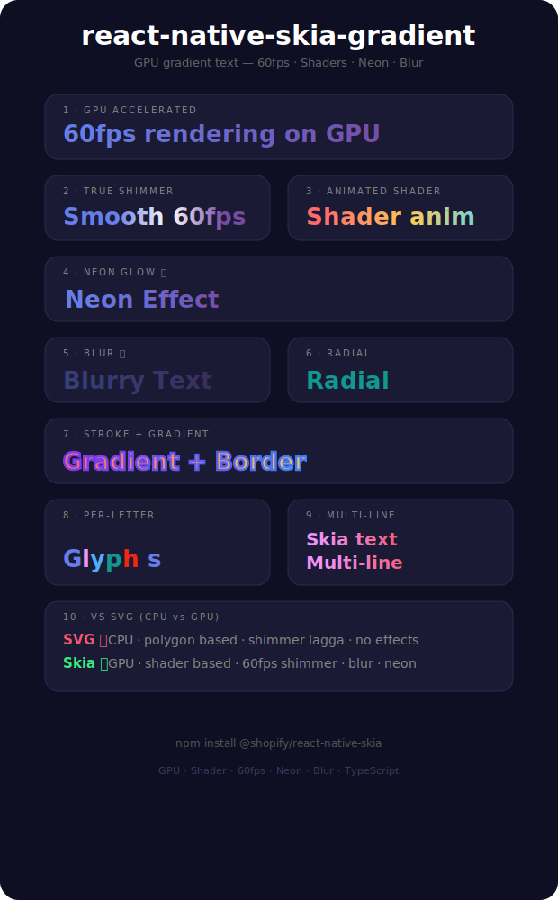

# react-native-skia-gradient

**GPU-accelerated** gradient text for React Native using `@shopify/react-native-skia`.

True 60fps animations, shader-based rendering, neon glow, blur — things SVG can't do.



## Why Skia instead of SVG?

| Feature | SVG (old lib) | Skia (this lib) |
|---------|---------------|-----------------|
| **Render engine** | CPU | **GPU** |
| **Shimmer** | Choppy (recalculates polygons) | **60fps** (shader offset) |
| **Animated colors** | setInterval re-render | **Shader animation** |
| **Neon glow** | ❌ impossible | ✅ `Shadow` + `BlurMask` |
| **Blur** | ❌ impossible | ✅ `BlurMask` |
| **Per-letter** | Many SVG elements | **Glyph-based** |
| **Text rendering** | SVG `<Text>` | Native Skia text |

## Installation

```bash
npm install react-native-skia-gradient
```

Requires `@shopify/react-native-skia`:

```bash
npx expo install @shopify/react-native-skia react-native-reanimated
```

> ⚠️ Skia requires a **Expo dev build** (not Expo Go) or bare React Native

## Usage

```tsx
import GradientText from 'react-native-skia-gradient';
```

### Basic

```tsx
<GradientText colors={['#667eea', '#764ba2']} fontSize={36}>
  Hello World
</GradientText>
```

### Shimmer (60fps)

```tsx
<GradientText
  colors={['#667eea', '#764ba2']}
  shimmer
  shimmerDuration={2000}
  fontSize={36}
>
  Smooth shimmer
</GradientText>
```

### Radial

```tsx
<GradientText
  colors={['#38ef7d', '#11998e']}
  gradientType="radial"
  cx={0.5}
  cy={0.5}
  fontSize={36}
>
  Radial
</GradientText>
```

### Neon glow 🏆

```tsx
<GradientText
  colors={['#00f2fe', '#4facfe']}
  neon
  neonColor="#00f2fe"
  fontSize={36}
>
  Neon
</GradientText>
```

### Blur 🏆

```tsx
<GradientText
  colors={['#667eea', '#764ba2']}
  blur={4}
  fontSize={36}
>
  Blurry
</GradientText>
```

### Stroke

```tsx
<GradientText
  colors={['#ff6b6b', '#feca57']}
  strokeColor="#7c3aed"
  strokeWidth={2}
  fontSize={36}
>
  Bordered
</GradientText>
```

### Animated colors

```tsx
<GradientText
  colors={['#ff6b6b', '#feca57', '#48dbfb', '#7c3aed']}
  animated
  animatedDuration={3000}
  fontSize={32}
>
  Cycling
</GradientText>
```

### Per-letter

```tsx
<GradientText
  colors={['#ff6b6b', '#feca57', '#48dbfb', '#7c3aed']}
  perLetter
  fontSize={36}
>
  Rainbow
</GradientText>
```

## Props

| Prop | Type | Default | Description |
|------|------|---------|-------------|
| colors | `string[]` | `['#667eea', '#764ba2']` | Color stops |
| gradientType | `'linear' \| 'radial'` | `'linear'` | Gradient shape |
| start | `{x, y}` | `{x:0, y:0}` | Linear start (0–1) |
| end | `{x, y}` | `{x:1, y:0}` | Linear end (0–1) |
| cx | `number` | `0.5` | Radial center X |
| cy | `number` | `0.5` | Radial center Y |
| fontSize | `number` | `24` | Font size |
| fontWeight | `string` | `'bold'` | Font weight |
| strokeColor | `string` | — | Text border color |
| strokeWidth | `number` | — | Text border width |
| letterSpacing | `number` | `0` | Letter spacing |
| textAlign | `string` | `'left'` | `'left' \| 'center' \| 'right'` |
| shimmer | `boolean` | `false` | Enable shimmer (60fps) |
| shimmerDuration | `number` | `2000` | Shimmer cycle (ms) |
| animated | `boolean` | `false` | Color cycling |
| animatedDuration | `number` | `3000` | Full cycle (ms) |
| perLetter | `boolean` | `false` | Per-letter gradient |
| blur | `number` | — | Blur radius (px) |
| neon | `boolean` | `false` | Neon glow effect |
| neonColor | `string` | — | Neon glow color |

## Example app

```bash
cd example
npm install
npx expo run:android  # or run:ios
```

## Requirements

- React Native 0.73+
- @shopify/react-native-skia 1.0+
- Expo dev build or bare workflow

## License

MIT
